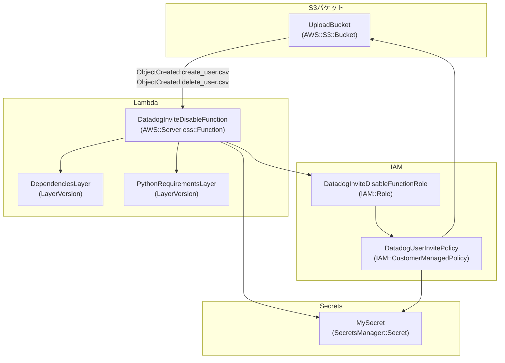

# Datadog user invite and disable utilities

## Description

Deploy a Lambda function to invite and disable Datadog users for each organization.

## Configuration diagram



## Files

```text
project-root/
├── src/                            # Lambda source code
│   └── app.py
├── layer/                          # Lambda Layer（include de pendency）
│   └── python/                     # site-packages
├── template.yaml                  
└── requirements.txt               # Layer dependency definition（pip install -t layer/python/）
```

## How to deploy

- Notice: Change YOUR_AWS_ACCOUNT to your aws account number

```bash
$ aws s3 mb s3://aws-sam-cli-managed-default-YOUR_AWS_ACCOUNT
$ sam deploy \
  --stack-name datadog-user-invite-and-disable \
  --s3-bucket aws-sam-cli-managed-default-YOUR_AWS_ACCOUNT \
  --s3-prefix datadog-user-invite-and-disable \
  --capabilities CAPABILITY_NAMED_IAM \
  --region ap-northeast-1 \
  --profile YOUR_AWS_PROFILE_NAME \
  --parameter-overrides \
    'ProjectName="datadog-user-invite-and-disable" \
    SourceBucketName="datadog-user-invite-and-disable-YOUR_AWS_ACCOUNT" \
    SecretName="ddOrgSecret" \
    S3EventName="s3:ObjectCreated:*" \
    LambdaRoleName="datadog-user-invite-and-disable-exec-role" \
    ManagedPolicyName="AWSLambdaBasicExecutionRole" \
    InlinePolicyName="datadog-user-invite-and-disable-inline-policy"'
```

## Edit Secret

- Edit YOUR_ORG_NAME, apiKey and apiKey value.

```json
{
  "orgs": {
    "Orgname": {
      "keys": {
        "apiKey": "123456789",
        "appKey": "123456789"
      }
    }
  }
}

```

## How to use

### create csv file

- create_user.csv

```csv
name,email,org,role
YourName,You@example.com,_YourOrganizationName,"Datadog Standard Role"
```

- delete_user.csv

```csv
name,email,org,role
YourName,You@example.com,_YourOrganizationName,"Datadog Standard Role"
```

### Invite user

- put create_user.csv to your s3 bucket

### Disable user

- put delete_user.csv to your s3 bucket
