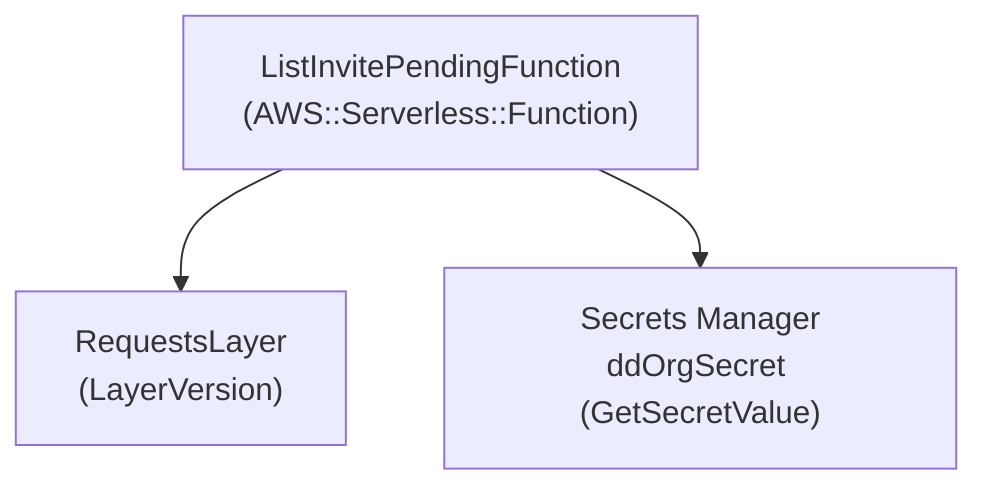

# Datadog user invite and disable utilities

## Description

Deploy a Lambda function to check invite pending Datadog users for each organization.

## Configuration diagram



## Files

```text
user-pending-check/
├── README.md
├── layer
│   ├── build.sh
│   └── requirements.txt
├── src
│   └── app
│       └── lambda_function.py
└── template.yaml
```

## How to deploy

- Notice: Change YOUR_AWS_ACCOUNT to your aws account number

```bash
$ aws s3 mb s3://aws-sam-cli-managed-default-YOUR_AWS_ACCOUNT
$ sam validate
$ sam build
$ sam deploy \
  --stack-name datadog-user-pending-check \
  --s3-bucket aws-sam-cli-managed-default-YOUR_AWS_ACCOUNT \
  --s3-prefix datadog-user-pending-check \
  --capabilities CAPABILITY_NAMED_IAM \
  --region ap-northeast-1 \
  --profile YOUR_AWS_PROFILE_NAME \
  --parameter-overrides \
    'ProjectName="datadog-user-pending-check" \
    SourceBucketName="datadog-user-pending-check-YOUR_AWS_ACCOUNT" \
    SecretName="ddOrgSecret" \
    S3EventName="s3:ObjectCreated:*" \
    LambdaRoleName="ListInviteDDUserLambdaRole"'
```

## How to use

- Execute the Lambda function, and pending users will be displayed in the log.
